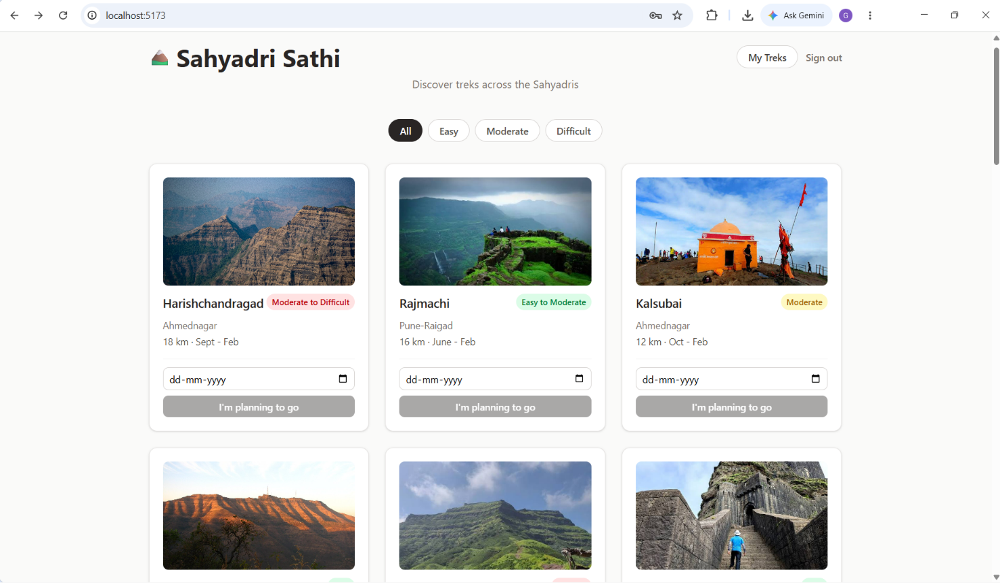
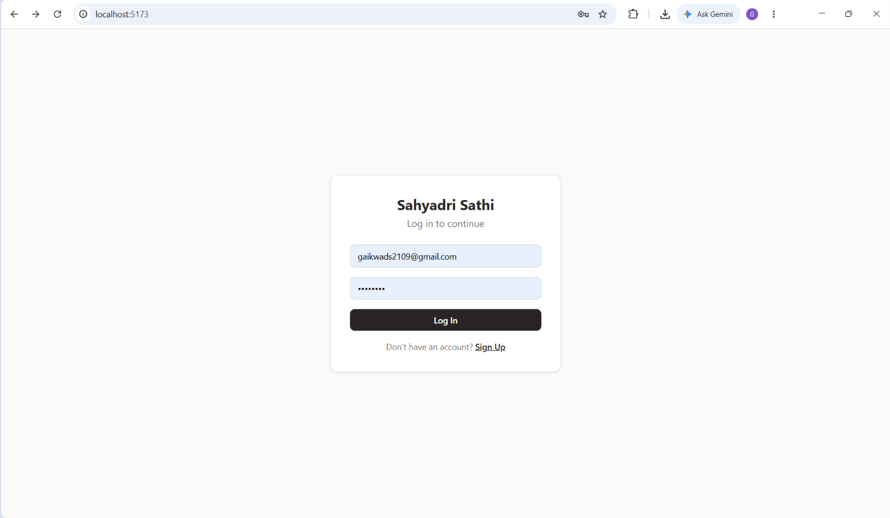
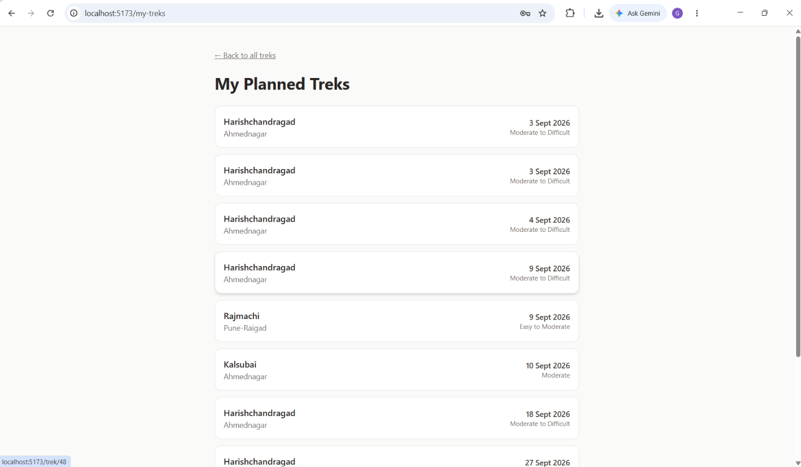

# 🏔️ Sahyadri Sathi

A trek planning app for the Western Ghats (Sahyadri range) — browse real treks, filter by difficulty, and see who else is planning to go on the same date.

**Live demo:** [add your Vercel link here once deployed]

## Why I built this

Most trek planning in Maharashtra happens through scattered WhatsApp groups and word of mouth. Sahyadri Sathi brings it into one place — browse real Sahyadri treks like Harishchandragad, Rajmachi, and Kalsubai, pick a date, and instantly see if other trekkers are headed the same way.

## Features

- 🔍 Browse and filter treks by difficulty (Easy / Moderate / Difficult)
- 🔐 User authentication — sign up, log in, log out
- 📅 Plan a trek for a specific date
- 👥 See how many other users are planning the same trek on the same date
- 📱 Fully responsive design

## Tech Stack

- **Frontend:** React, TypeScript, Tailwind CSS
- **Backend & Database:** Supabase (PostgreSQL + Auth)
- **Deployment:** Vercel

 

## Screenshots

## Running locally

Clone the repo and install dependencies: